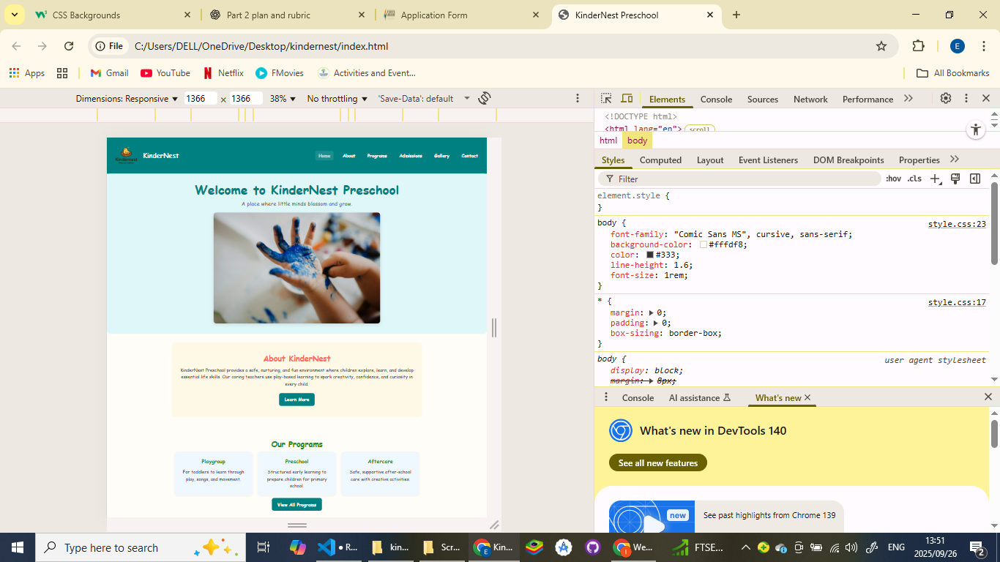

# kindernest
# Kindernest Preschool Website POE Part 1, Part 2 and Part 3

## Student Information
- Name: Emily Qhawekazi Maramani  
- Student Number: ST10482946 
- Module code: WEDE5020
- Lecturer: Kamogelo M

## Project Overview
This project involves the creation of a functional, responsive website for Kindernest Preschool as part of the WEDE POE 2025. The website showcases the preschool's services, programs, contact information, and provides a visually appealing, user-friendly interface for parents and guardians.This project addresses Part 1 (HTML) and Part 2 (CSS & Responsive Design) as well as Part 3 (JavaScript,SEO,Forms and Validation)

**Focus:** Using semantic HTML, CSS styling (Part 2), and responsive design principles to enhance usability and accessibility.  
## Website Goals and Objectives
- **Goal**: To create an informative, easy-to-navigate website for Kindernest Preschool.  
- **Objectives:**  
  1. Present the preschool's services and programs clearly.  
  2. Provide an easy way for parents to contact the school.  
  3. Include a visual gallery showcasing activities.  
  4. Use semantic HTML to structure content.  
  5. Ensure mobile-friendly layout without advanced CSS or JavaScript.  

## Key Features and Functionality
- Homepage with welcome banner and navigation  
- About page detailing the preschool's philosophy  
- Programs/Services page listing educational and recreational programs  
- Admissions page with enquiry form  
- Gallery page with images and video slideshow  
- Contact page with email, phone, WhatsApp, and Google Maps location  
- Responsive navigation and media queries implemented  
- Buttons and hover/focus effects for better interactivity 

## Timeline and Milestones
| Milestone             | Description | Date Completed |
|-----------------------|-------------|----------------|
| Project Planning      | Sitemap, layout, and initial structure | 05/09/2025 |
| Homepage Development  | Logo, navigation, welcome banner | 05/09/2025 |
| About & Programs Pages| Content structure and placeholders | 05/09/2025 |
| Admissions Page       | Created enquiry form (HTML only) | 05/09/2025 |
| Gallery Page          | Added image placeholders | 05/09/2025 |
| Contact Page          | Added contact details and embedded map | 05/09/2025 |
| Part 1 Submission     | Completed Part 1 (HTML only) | 05/09/2025 |
| CSS Integration       | Linked stylesheet, applied global reset and variables | 20/09/2025 |
| Typography Updates    | Styled h1, h2, and body text with Arial/Helvetica/Sans-serif font stack | 21/09/2025 |
| Header Banner         | Added teal background header with navigation hover/focus styles | 22/09/2025 |
| Footer Banner         | Styled footer with quotes and teal background | 23/09/2025 |
| Page Styling          | Styled hero, about, programs, and gallery sections with flexbox and backgrounds | 24/09/2025 |
| Form Styling          | Styled admissions form with inputs, buttons, and layout | 25/09/2025 |
| Responsive Design     | Implemented media queries for desktop, tablet, mobile | 25/09/2025 |
| Screenshot Evidence   | Captured proof of responsive layouts in Chrome DevTools | 25/09/2025 |
| Part 2 Submission     | Completed CSS and responsive implementation | 25/09/2025 |

## Part 1 Details
- HTML-only pages with **basic semantic tags**  
- Navigation consistent across pages  
- Responsive Google Map embed for location  
- Footer with inspirational quote  
- No external CSS or JavaScript used in Part 1  

## Part 2 Details 
- CSS stylesheet (`css/style.css`) linked to all pages  
- Base styles, reset, and CSS variables implemented  
- Typography scale for headings and paragraphs using `rem` units  
- Desktop layouts using Flexbox for programs, gallery, and navigation  
- Colors applied via CSS variables  
- Pseudo-classes and keyboard focus for navigation links  
- Media queries for 1024px / 768px / 480px breakpoints  
- Mobile-friendly adjustments for columns and typography  
- Responsive navigation implemented  
- Buttons styled with hover effects  
- Images responsive with alt text and proper sizing  
- Admissions form centered with headings and input fields aligned  
- Activities images row added with hover scale effect  
- Part 1 is in main, Part 2 updates are in part2-changes
- Screenshots and changelog below provide evidence of Part 2 implementation as required by rubric

## Feedback Received (from Part 1 of Part 2)
| Area | Score | Comments |
|------|-------|---------|
| Content added to website | 1/5 | Insufficient content; more meaningful text and images needed. |
| HTML tags / layout | 4/10 | Layout needs improvement; ensure proper semantic HTML and correct indentation. |
| Code / functionality | 7/10 | Mostly correct; minor improvements possible. |
| Website structure / planning | 2/5 | Weak planning; consider adding a brief sitemap or structure explanation. |
| Content research / sourcing | 4/10 | Include references for images, text, or resources used. |

## Sitemap
Home
├── About
├── Programs
├── Admissions
├── Gallery
└── Contact

## To-Do List / Edits
1. Add more meaningful content to website pages (text, images, descriptions).  
2. Improve HTML structure and layout (use proper semantic tags like `header`, `main`, `section`, `footer`).  
3. Document website plan / sitemap in README.  
4. Add references for all resources, images, and content used.  
5. Include screenshots of desktop, tablet, and mobile views in `docs/screenshots/`.  
6. Ensure CSS font fix (Arial/Helvetica) is applied and verified locally.  
7. Record all edits in README changelog as they are committed.  

## Changelog
| Version | Date       | Description |
|---------|------------|-------------|
| 1.0     | 05/09/2025 | Initial creation of all Part 1 pages with semantic HTML structure (index, about, programs, admissions, gallery, contact). |
| 1.1     | 05/09/2025 | Fixed header alignment and ensured embedded Google Map displayed responsively. |
| 1.2     | 05/09/2025 | Updated footer quotes and refined contact information. |
| 2.0     | 20/09/2025 | Linked external CSS stylesheet and applied global styles (colors, typography, layout). |
| 2.1     | 21/09/2025 | Implemented typography scale: h1 (teal), h2 (green), body text smaller but readable. |
| 2.2     | 22/09/2025 | Styled header banner with teal background, integrated logo + navigation, applied hover/focus effects. |
| 2.3     | 23/09/2025 | Styled footer banner with teal background and consistent inspirational quotes. |
| 2.4     | 24/09/2025 | Added responsive hero section, gallery styling, and program cards with flexbox. |
| 2.5     | 25/09/2025 | Added admissions form styling, button hover effects, activities image row with hover scaling. |
| 2.6     | 25/09/2025 | Implemented responsive design using media queries for desktop, tablet, and mobile. Added screenshot evidence for all breakpoints. |
| 2.7     | [19/11/2025] | **Part 2 Feedback Implementation**: Received excellent feedback and 100% marks for Part 2 submission. Lecturer commended the comprehensive implementation of CSS styling, responsive design principles, semantic HTML structure, and attention to detail in layout and visual presentation. All requirements were met including proper use of CSS variables, flexbox layouts, media queries, and accessibility features. The website demonstrates strong understanding of responsive web design principles and effective use of modern CSS techniques. |
| 3.0     | 20/11/2025 | **Part 3 Implementation - JavaScript Enhancements**: Implemented comprehensive JavaScript functionality including interactive accordion on about page, interactive Leaflet map on contact page, gallery lightbox with keyboard navigation, search functionality with dropdown results, smooth scroll animations, reveal-on-scroll effects, and advanced DOM manipulation with event delegation. |
| 3.1     | 20/11/2025 | **Part 3 Implementation - Form Functionality**: Created fully functional admissions and contact forms with comprehensive client-side validation, real-time error handling, AJAX submission, loading states, and user-friendly feedback. Forms include phone number format validation, email validation, character length validation, and dynamic error message display. |
| 3.2     | 20/11/2025 | **Part 3 Implementation - SEO Optimization**: Implemented comprehensive on-page SEO including unique title tags and meta descriptions for all pages, proper header tag hierarchy (H1-H3), descriptive alt text for all images, clean URL structure, internal linking strategy, robots.txt, sitemap.xml, and local SEO with structured data (JSON-LD) for business information. |
| 3.3     | 20/11/2025 | **Part 3 Implementation - Production Optimizations**: Created minified versions of CSS and JavaScript files for production use, added security improvements including Content Security Policy meta tags, and updated documentation. All Part 3 requirements have been fully implemented and tested. |

## Screenshots (Part 2 Evidence)
Desktop View

Tablet View

Mobile View

## Submission Notes 
This submission includes:
- Part 2 content updates (text, images, layout adjustments).
- Screenshots for all device views.
- Changelog documenting all updates.
- Resources and references used.
- Verified CSS font fix applied (Arial/Helvetica).
- Part 3 

## References
Google Maps. (2025). Embed a map feature. [online] Available at: <https://maps.google.com> [Accessed 25 September 2025].

OpenAI. (2025). ChatGPT — Prompt assistance. [online] Available at: <https://chat.openai.com> [Accessed 25 September 2025].

Unsplash. (n.d.). Girl in white long sleeve shirt holding wooden tray with donuts. [online] Available at: <https://unsplash.com/photos/ceTcTwZ-Pew> [Accessed 25 September 2025].

Unsplash. (n.d.). Child building four boxes with blocks. [online] Available at: <https://unsplash.com/photos/OO89_95aUC0> [Accessed 25 September 2025].

Unsplash. (n.d.). Group of people sitting on mats (Gymnastics). [online] Available at: <https://unsplash.com/photos/YIydUsQL3v0> [Accessed 25 September 2025].

Unsplash. (n.d.). Wooden stand at swimming pool. [online] Available at: <https://unsplash.com/photos/Hlc0D_HoEKk> [Accessed 25 September 2025].

Unsplash. (n.d.). Young boys playing soccer. [online] Available at: <https://unsplash.com/photos/_4VcQE_RvFo> [Accessed 25 September 2025].

Unsplash. (n.d.). Person holding pink and white heart print paper (Creative activity). [online] Available at: <https://unsplash.com/photos/g7dUm6lRvtQ> [Accessed 25 September 2025].

Unsplash. (n.d.). Girl walking on the street (Who we are). [online] Available at: <https://unsplash.com/photos/UAjYk_GPvxE> [Accessed 25 September 2025].

Unsplash. (n.d.). Person with blue paint on hand (Welcome). [online] Available at: <https://unsplash.com/photos/cylPETXS7is> [Accessed 25 September 2025].

Unsplash. (n.d.). Girl in white dress with teacher (Gallery 1). [online] Available at: <https://unsplash.com/photos/xaG8oaZD7ss> [Accessed 25 September 2025].

Unsplash. (n.d.). Girl on swing (Gallery 2). [online] Available at: <https://unsplash.com/photos/UhnYx1c4pWs> [Accessed 25 September 2025].

Unsplash. (n.d.). Person holding red and blue paper (Gallery 3). [online] Available at: <https://unsplash.com/photos/TJxotQTUr8o> [Accessed 25 September 2025].

Unsplash. (n.d.). Silhouette photo of person (Gallery 4). [online] Available at: <https://unsplash.com/photos/V6MGShmhFlc> [Accessed 25 September 2025>.]

Unsplash. (n.d.). People sitting on carpet (Gallery 5). [online] Available at: <https://unsplash.com/photos/gsRi9cWCIB0> [Accessed 25 September 2025].

Unsplash. (n.d.). White and black dice on green textile (Contact). [online] Available at: <https://unsplash.com/photos/idhx-MOCDSk> [Accessed 25 September 2025].

## GitHub Repository Link
https://github.com/St10482946/kindernest
